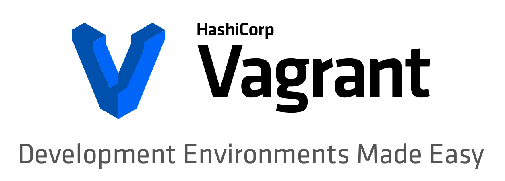

# Vagrant 101

This lab kicks off the "Vagrant Up for Network Engineers" module by introducing the Open Source tool Vagrant, and giving you a basic run down of it's typical usage.  

## Objectives

The objective of this lab is to:

* Explain what problem Vagrant solves
* Introduce the basic commands and usage of Vagrant
* Explore the default Vagrantfile

## Prerequisites

In order to complete this lab you will need a development workstation with Vagrant and other tools installed.  

The recommendation is to leverage the [DevBox DevNet Sandbox](https://devnetsandbox.cisco.com/RM/Diagram/Index/f1a51f3b-3377-444d-97f0-5ad300d976be?diagramType=Topology) which has all the pre-requisites installed and ready to go so you can immediately begin the lab.  As an alternative you can leverage your own workstation for the lab, but you'll need to follow the steps listed in the "Setup your own computer" information at the top of the lab.  

### Using the DevBox Sandbox

1. Reserve an instance of the Sandbox by clicking navigating the [DevBox Sandbox](https://devnetsandbox.cisco.com/RM/Diagram/Index/f1a51f3b-3377-444d-97f0-5ad300d976be?diagramType=Topology) page.  Because some of the labs in this module build upon earlier labs, you should reserve your sandbox for long enough that you'll be able to complete all labs in this module.  
1. Once your Sandbox is fully provisioned you'll be sent an email with the VPN credentials to connect to your sandbox.  Connect to your environment using either AnyConnect or OpenConnect.  
1. You can leverage either SSH or RDP to connect to the DevBox at the address of 10.10.20.20 with credentials of root/cisco123.  

### Your Own Workstation

1. Click the link at the top of the page for "Setup your own computer".
1. Follow the setup details to install and configure all the prerequisites needed for the labs in this module.  

## Step 1: What is Vagrant?

[Vagrant](http://vagrantup.com) is an Open Source tool developed and maintained by the company [HashiCorp](https://www.hashicorp.com).  HashiCorp is a well known company that makes DevOps tooling and applications to support micro service applications.  

<!--  -->

Vagrant's tag line is "Development Environments Made Easy", and that's exactly what it is.  Vagrant was developed to make it very simple for application developers to quickly manage the development environments for different projects they were working on.  To understand what this means, or why it's important consider how development environments used to work.  

### A bit of history...

You've probably heard the quote, or seen the [meme](http://www.developermemes.com/2013/12/13/worked-fine-dev-ops-problem-now/) "Worked fine in dev... it's an ops problem now".  The root of this quote is the pre-DevOps mindset that the software developer wasn't responsible for their software once they finished their work and passed it along.  However, with the move to DevOps the software developer is very much responsible for their application even after they finish working on the initial code.  This lead to a rethinking of how developers should write and test their code.  

In the "old days", software developers would often just write and test their code directly on their development workstation.  This workstation was loaded up with development tools, libraries, debuggers, applications, and customizations that made it an excellent tool for the developer.  However, it looked nothing like the final production environment servers that the running application would be finally installed onto.  This discrepancy lead to many cases where something that ran fine in "dev" failed in "prod".  

As the development and operations teams began to come together with DevOps, it was realized that if developers would develop and test their code in environments that were close, if not identical, to production  many problems could be completely avoided.  The challenge was how to make that process simple for developers.  

### Enter Vagrant

It was for this purpose vagrant was developed.  

Vagrant allows developers to include a simple configuration file along with the code that describes the development environment.  This file, the `Vagrantfile`, describes all the requirements necessary to create the full environment for the application.  This can include the creation of virtual machines from basic templates (known as "[boxes](https://www.vagrantup.com/intro/getting-started/boxes.html)"), customization of the operating system, installation of software requirements, and much more.  With this configuration file developers can simply type `vagrant up` to have a fresh and fully configured development environment instantiated.  

Vagrant is a command line tool that fits well into a developers workflow that manages virtualization platforms that are referred to as "[providers](https://www.vagrantup.com/intro/getting-started/providers.html)".  Vagrant, by itself, cannot start a virtual machine or application container.  What Vagrant does is use the APIs for other systems like VirtualBox, VMware, AWS, Docker, and many more to instantiate the environment resources and provides a simple and consistent command line interface for developers to use.  

Vagrant is multi-platform from both guest and host perspective.  You can install Vagrant on Linux, OS X, and Windows operating systems and the development environments it is managing can span all as well.  

#### Next Step: Vagrant Commands
